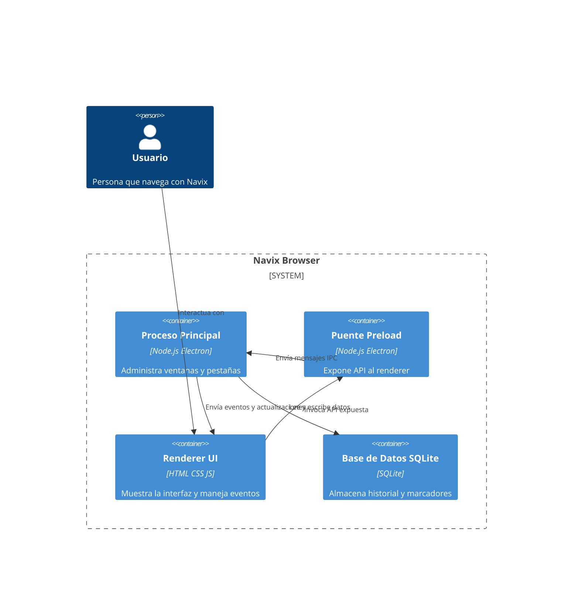

# README.md  
Este archivo ofrece una visión general del proyecto Navix, un navegador de código abierto basado en Electron y JavaScript. Contiene el título, descripción breve y los recursos esenciales para comenzar.

- **Título**: Navix 🖥️  
- **Descripción**: Navegador web de código abierto escrito en JavaScript y Electron, con interfaz inspirada en Google.  
- **Imagen**: Logo en la cabecera (pendiente de subir).  

```markdown
# Navix 🖥️
Navegador web de código abierto escrito en JavaScript y Electron.
```

---

## main.js  
Este es el **proceso principal** de la aplicación Electron. Administra la ventana, las pestañas y la comunicación IPC con el renderer.

- Importa módulos de Electron (`app`, `BrowserWindow`, `BrowserView`, `ipcMain`) y Node (`path`).
- Carga la interfaz desde `renderer/index.html`.
- Gestiona un arreglo `views` con cada `BrowserView` (pestaña) y su URL.
- Expone handlers IPC para crear, cambiar, cerrar pestañas y navegación (atrás, adelante, recargar).
- Inicializa la base de datos y la ventana al arrancar la app; cierra la app al cerrarse todas las ventanas.

### Estructura de funciones  
| Función         | Descripción                                            |
|-----------------|--------------------------------------------------------|
| `createWindow`  | Inicializa `BrowserWindow` y carga el HTML principal.  |
| `createTab`     | Añade un `BrowserView`, carga URL y gestiona eventos.  |
| `switchTab`     | Muestra una pestaña ocultando las demás.               |
| `closeTab`      | Destruye y elimina una pestaña, ajusta la pestaña activa. |
| Handlers IPC    | Manejan mensajes desde el renderer via `ipcMain.handle`. |

```js
ipcMain.handle('create-tab', (_, url) => createTab(url));
ipcMain.handle('navigate', (_, url) => { /* ... */ });
ipcMain.handle('get-tabs', () => views.map((v,i) => ({ index: i, url: v.url })));
```

---

## preload.js  
Ejecutado en el **contexto aislado** antes de `renderer.js`. Usa `contextBridge` para exponer una API segura (`window.navixAPI`) sin habilitar `nodeIntegration`.

- Conecta `ipcRenderer.invoke` con métodos accesibles en el renderer.
- Permite crear, cambiar y cerrar pestañas; navegar; obtener lista de pestañas; y registrar listeners de eventos.

```js
contextBridge.exposeInMainWorld('navixAPI', {
  createTab: url => ipcRenderer.invoke('create-tab', url),
  switchTab: index => ipcRenderer.invoke('switch-tab', index),
  /* back, forward, reload, getTabs, on */
});
```

---

## renderer/index.html  
Plantilla HTML de la interfaz de usuario. Define la estructura básica:

- **Barra superior** con:
  - Logo “⛵ Navix”  
  - Botones de navegación (atrás, adelante, recargar)  
  - Input de dirección y botón “Ir”  
  - Botón para nueva pestaña  
- **Contenedor de pestañas** donde se renderizan los botones de cada pestaña  
- **Placeholder de contenido**: muestra un mensaje inicial  
- Incluye `renderer.js` al final para gestionar la lógica UI.

```html
<!doctype html>
<html lang="es">
<head>
  <meta charset="utf-8" />
  <meta http-equiv="Content-Security-Policy" content="default-src 'self' https: data:;" />
  <title>Navix Browser</title>
  <link rel="stylesheet" href="styles.css" />
</head>
<body>
  <div id="topbar">…</div>
  <div id="tabs"></div>
  <div id="content-placeholder">…</div>
  <script src="renderer.js"></script>
</body>
</html>
```

---

## renderer/renderer.js  
Controla la **lógica de la UI** y la interacción con `window.navixAPI`.

- Obtiene referencias a elementos del DOM (input, botones, contenedores).
- Define la lista local `tabs` y la función `renderTabs()` para actualizar botones de pestañas.
- Funciones asíncronas:
  - `newTab(url)`: crea una pestaña y refresca lista.
  - `navigate()`: navega a la URL del input.
- Vincula eventos de click y teclado para disparar acciones (crear, cambiar, cerrar pestaña; navegación atrás/adelante/recargar).
- Escucha eventos (`tab-updated`, `active-tab`, `tab-changed`) enviados desde el proceso principal.

```js
async function newTab(url) {
  await window.navixAPI.createTab(url || 'https://www.google.com');
  tabs = await window.navixAPI.getTabs();
  renderTabs();
}
```

---

## db.js  
Encapsula el acceso a SQLite para **historial y marcadores**.

- Ruta de la base: `navix.sqlite`.
- Función `init()`: crea la BD y tablas `history` y `bookmarks` si no existen.
- Métodos:
  - `addHistory(url)`: inserta nueva visita.
  - `getHistory(limit, cb)`: recupera últimas visitas.
  - `addBookmark(title, url, cb)`: inserta marcador.
  - `getBookmarks(cb)`: lista marcadores ordenados.

```js
db.serialize(() => {
  db.run(`CREATE TABLE IF NOT EXISTS history (
    id INTEGER PRIMARY KEY AUTOINCREMENT,
    url TEXT NOT NULL,
    visited_at DATETIME DEFAULT CURRENT_TIMESTAMP
  )`);
  /* similar para bookmarks */
});
```

---

## navix.sqlite  
Archivo SQLite que almacena los datos persistentes.

| Tabla       | Campos                                    |
|-------------|-------------------------------------------|
| history     | id, url, visited_at                       |
| bookmarks   | id, title, url, created_at                |

Este fichero se genera al primer arranque por `db.init()` y guarda el historial de navegación y los marcadores.

---

